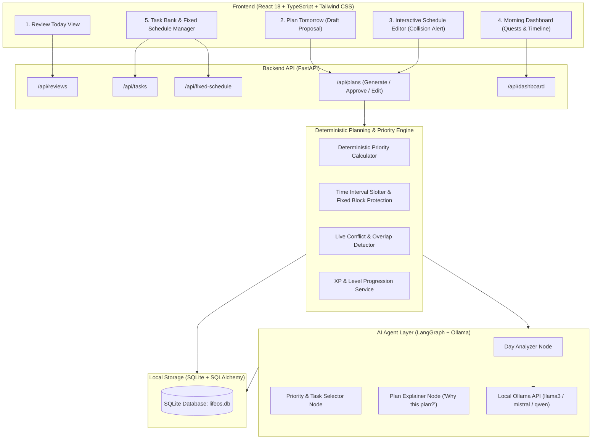

# LifeOS — Local-First Agentic AI Planner & Daily Operating System

> A local-first, privacy-focused daily life operating system powered by deterministic scheduling algorithms, LangGraph agent workflows, and local Ollama LLMs.

---

## 🌟 Overview & Core Concept

**LifeOS** solves the problem of unrealistic and fragile daily scheduling by combining a strict **Deterministic Constraint Engine** with an **Agentic AI Layer (LangGraph + Ollama)**.

### The Cyclic Daily Loop:
```
┌────────────────────────────────────────────────────────┐
│ 1. NIGHTLY REVIEW                                      │
│    - Review today's completed/missed tasks             │
│    - Reflect on energy and obstacles (+50 XP)          │
└────────────────────────┬───────────────────────────────┘
                         │
                         ▼
┌────────────────────────────────────────────────────────┐
│ 2. PLAN TOMORROW                                       │
│    - Deterministic priority scoring & bin-packing      │
│    - Fixed commitment protection (Gym, College, etc.)  │
│    - AI qualitative analysis & "Why this plan?" reason │
│    - Interactive schedule editor with live collision   │
│      detection & conflict resolution                   │
└────────────────────────┬───────────────────────────────┘
                         │
                         ▼
┌────────────────────────────────────────────────────────┐
│ 3. USER APPROVAL & LOCK                                │
│    - Lock and approve tomorrow's schedule              │
└────────────────────────┬───────────────────────────────┘
                         │
                         ▼
┌────────────────────────────────────────────────────────┐
│ 4. NEXT MORNING: EXECUTE                               │
│    - "Good Morning, Hero ☀️" Dashboard                 │
│    - Level 12 Main Quests & XP Rewards                 │
│    - Chronological interactive execution timeline      │
└────────────────────────┬───────────────────────────────┘
                         │
                         ▼
                     [ REPEAT ]
```

---

## 🏛️ System Architecture



---

## ⚡ Core Features

1. **Fixed Commitment Protection**:
   - Initial defaults: `05:00–06:30` (Gym), `06:30–07:30` (Get ready), `07:30–12:50` (College), `12:50–13:15` (Lunch).
   - Flexible tasks are **never** scheduled over fixed blocks.
2. **Deterministic Priority Engine**:
   - Scores tasks based on Deadline Urgency ($+100$ for $<24\text{h}$), Importance ($1\text{--}5 \times 15$), Goal Relevance ($1\text{--}5 \times 10$), Missed Carryover penalty ($+25$), and Energy matching.
3. **Realistic Workload & Buffer Constraints**:
   - Respects 8-hour maximum daily workload limit (`max_daily_work_minutes: 480`).
   - Inserts mandatory 15-minute breaks after 90-minute focus blocks and 30-minute rest after long commitments.
   - Automatically postpones overflow tasks to protect sleep (`22:00–05:00`).
4. **Resilient AI Layer (LangGraph + Ollama)**:
   - Uses local LLMs for qualitative reflection analysis and natural-language "Why this plan?" explanations.
   - **Zero-Downtime Fallback**: If Ollama is offline, the deterministic engine automatically produces the plan without errors.
5. **Interactive Schedule Editor with Collision Detection**:
   - Instant validation of user drag/time modifications against fixed commitments and other tasks.
6. **Gamified Morning Dashboard**:
   - Level & XP progression (+50 XP Review, +40 XP DSA, +50 XP Projects, +30 XP Applications, +20 XP Assignments).
   - Main Quest check-off mechanics.

---

## 🚀 Quick Start Guide

### Prerequisites
- **Python 3.10+**
- **Node.js 18+** & **npm**
- *(Optional for AI reasoning)*: [Ollama](https://ollama.com/) running locally with `llama3` (`ollama run llama3`).

---

### 1. Backend Setup

```powershell
# Navigate to backend directory
cd backend

# Activate virtual environment
.\venv\Scripts\Activate.ps1

# (Optional) Seed initial data (Fixed Schedule & Tasks)
python seed_data.py

# Start FastAPI server
uvicorn app.main:app --reload --port 8000
```
Backend API will be live at: **`http://localhost:8000`**  
Interactive API Docs (Swagger): **`http://localhost:8000/docs`**

---

### 2. Frontend Setup

```powershell
# Open a new terminal and navigate to frontend directory
cd frontend

# Install dependencies (if not already installed)
npm install

# Start Vite dev server
npm run dev
```
Frontend Web UI will be live at: **`http://localhost:5173`**

---

## 🧪 Running Automated Tests

```powershell
# In backend directory with virtual environment activated:
cd backend
.\venv\Scripts\Activate.ps1
pytest -v
```

**Test Coverage Summary:**
- `test_agent.py`: LangGraph workflow & resilient Ollama offline fallback.
- `test_api.py`: FastAPI endpoints for tasks, fixed schedule, daily reviews, and plan approval.
- `test_conflict.py`: Real-time schedule overlap & collision detection.
- `test_daily_loop_e2e.py`: Full multi-day end-to-end loop simulation (Review $\rightarrow$ Plan $\rightarrow$ Approve $\rightarrow$ Morning Dashboard $\rightarrow$ Execution $\rightarrow$ Level Progression).
- `test_db_models.py`: SQLAlchemy models, foreign keys, cascades, and XP audit transactions.
- `test_priority.py`: Mathematical priority scoring formulas and ranking.
- `test_scheduler.py`: Constraint satisfaction, fixed block protection, and overflow postponement.

---

## 📋 API Endpoints

| Method | Endpoint | Description |
|---|---|---|
| `GET` | `/api/health` | Service health and database connection check |
| `GET` | `/api/fixed-schedule` | List all active fixed recurring commitments |
| `POST` | `/api/fixed-schedule` | Create new fixed commitment |
| `DELETE` | `/api/fixed-schedule/{id}` | Remove a fixed commitment |
| `GET` | `/api/tasks` | List tasks (filter by status, category) |
| `POST` | `/api/tasks` | Create candidate task |
| `PATCH` | `/api/tasks/{id}/status` | Update task status & actual duration |
| `GET` | `/api/reviews/today` | Fetch review state, today's tasks & XP |
| `POST` | `/api/reviews` | Submit nightly review & reflection (+50 XP) |
| `POST` | `/api/plans/generate` | Generate proposed draft schedule using Deterministic + AI |
| `GET` | `/api/plans/latest` | Fetch current active or draft plan |
| `POST` | `/api/plans/{id}/validate-edit` | Validate manual edits & detect interval collisions |
| `POST` | `/api/plans/{id}/approve` | Lock & approve tomorrow's plan |
| `POST` | `/api/plans/{id}/regenerate` | Re-run generation with alternative balancing strategy |
| `GET` | `/api/dashboard/morning` | Fetch morning quest view & timeline |
| `POST` | `/api/dashboard/block-status` | Check off scheduled block & award real-time XP |

---

## 📂 Project Structure

```
MakePlannerai/
├── backend/
│   ├── app/
│   │   ├── main.py                  # FastAPI application entry point
│   │   ├── config.py                # Configuration & settings
│   │   ├── database.py              # SQLAlchemy engine & session factory
│   │   ├── models/                  # Database models (User, Tasks, Reviews, Plans, XP)
│   │   ├── schemas/                 # Pydantic schemas for request/response validation
│   │   ├── services/                # Deterministic priority, scheduling, and conflict engines
│   │   ├── agents/                  # LangGraph agent pipeline & Ollama client
│   │   └── routers/                 # API route handlers
│   ├── tests/                       # Pytest test suite (21 unit & integration tests)
│   ├── seed_data.py                 # Initial fixed schedule & sample task seeder
│   └── requirements.txt             # Python dependencies
│
├── frontend/
│   ├── src/
│   │   ├── api/                     # Axios REST API client bindings
│   │   ├── components/              # Reusable UI components (Timeline, Badges, Modals)
│   │   ├── pages/                   # Morning Dashboard, Nightly Review, Plan Tomorrow, Tasks, Schedule
│   │   ├── types/                   # TypeScript interface definitions
│   │   ├── App.tsx                  # Main App with navigation tabs
│   │   └── main.tsx                 # React DOM mount point
│   ├── package.json
│   └── vite.config.ts
└── README.md
```
